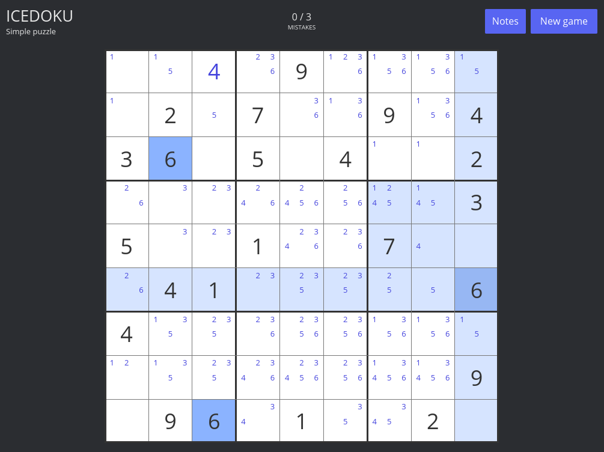

# IceDoku

IceDoku is a compact desktop Sudoku game built with Rust and [Iced](https://iced.rs/).



## Features

- Four difficulty levels
- Immediate mistake feedback with a three-mistake limit
- Candidate notes with automatic cleanup across rows, columns, and boxes
- Dedicated win and game-over screens

## Controls

| Action | Control |
| --- | --- |
| Select a cell | Left click |
| Enter a digit | `1`–`9` or the numeric keypad |
| Toggle Notes mode | `N` or the **Notes** button |
| Clear a cell or its notes | `Backspace` |
| Clear the selection | `Escape` |

## Run

Install a recent stable Rust toolchain, then run:

```sh
cargo run --release
```
